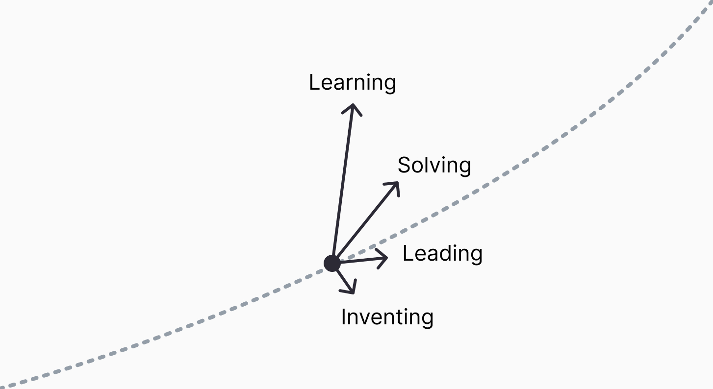

The start of your career is a dunting place to be. So I 'designed' what I'd like to achieve with my work life. This is that study. I will spend half my waking life at work, so I want to ensure I spend that time well. 

>See this as less of a plan, and more of an outline of my career. The universe doesn't care about I have planned.   

## What is my superpower?
As a genralist, trying to pin down my superpower was rather difficult. But after  Curiosty and Empathy

## Growth over time

Hard skills come and go, soft skills do not. I've chosen 4 key areas to focus on my growth. Right now I am in my first role as a UI/UX Designer. I am prioritisng learning and solving.

